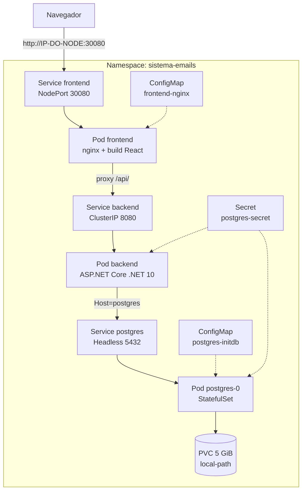

# sistema-emails-k8s

Aplicação full-stack (React + ASP.NET Core + PostgreSQL) implantada em um cluster **Kubernetes single-node** montado do zero com `kubeadm` em Ubuntu Server 24.04.

> **Créditos:** a aplicação (front-end e back-end) foi desenvolvida por [Edson Junior](https://github.com/edsonjunior-portfolio) e está publicada aqui com a autorização dele.
> A infraestrutura (cluster Kubernetes, manifestos, containerização e adequações para rodar no cluster) foi feita por [Tiago Stockmann](https://github.com/TiagoStockmann).

---

## Sumário

- [Visão geral](#visão-geral)
- [Arquitetura](#arquitetura)
- [Especificações](#especificações)
- [Estrutura do repositório](#estrutura-do-repositório)
- [Adequações feitas no código](#adequações-feitas-no-código)
- [Instalação do cluster](#instalação-do-cluster)
- [Deploy da aplicação](#deploy-da-aplicação)
- [Validação e testes de resiliência](#validação-e-testes-de-resiliência)
- [Atualização de versões](#atualização-de-versões)
- [Troubleshooting](#troubleshooting)
- [Próximos passos](#próximos-passos)

---

## Visão geral

O **sistemaDeEmails** é uma aplicação web para cadastro de clientes e seus contatos de e-mail, com páginas para gerar comunicações padronizadas (alertas, triagens e tickets).

Este repositório reúne em um só lugar:

- o código do **front-end** e do **back-end**;
- os **manifestos Kubernetes** que sobem a aplicação completa;
- um **seed de exemplo** para popular o banco.

---

## Arquitetura



**Decisões de arquitetura:**

- **Só o front-end é exposto.** Backend e banco são `ClusterIP` e existem apenas dentro do cluster.
- **O navegador nunca fala direto com a API.** O React usa `baseURL: "/api"` (caminho relativo) e o nginx faz o proxy para o Service do backend. Isso elimina problemas de CORS e IPs fixos no JavaScript.
- **Nomes no lugar de IPs.** O nginx aponta para `backend.sistema-emails.svc.cluster.local` e o backend para `Host=postgres`, resolvidos pelo DNS interno do cluster.
- **Banco com estado persistente.** O Postgres roda como `StatefulSet` com `volumeClaimTemplates`, então os dados sobrevivem à recriação do pod.
- **Ordem de inicialização garantida.** Um `initContainer` segura o backend até o Postgres responder, evitando `CrashLoopBackOff` na subida.

---

## Especificações

### Infraestrutura

| Item | Valor |
|---|---|
| Sistema operacional | Ubuntu Server 24.04 LTS |
| Topologia | 1 node (control plane + workload) |
| Recursos recomendados | 4 vCPU, 8 GB RAM, 60 GB disco |
| Kubernetes | v1.36 (kubeadm, kubelet, kubectl) |
| Container runtime | containerd (cgroup driver `systemd`) |
| Build de imagens | Docker CE |
| CNI | Flannel (`10.244.0.0/16`) |
| Storage | local-path-provisioner (StorageClass padrão) |
| Métricas | metrics-server |

### Aplicação

| Componente | Tecnologia | Imagem | Tipo | Porta |
|---|---|---|---|---|
| Front-end | React 19 + Vite + TypeScript, servido por nginx | `sistema-emails-frontend` | Deployment | 80 (NodePort 30080) |
| Back-end | ASP.NET Core (.NET 10) + EF Core + Npgsql | `sistema-emails-backend` | Deployment | 8080 |
| Banco | PostgreSQL 16 | `postgres:16-alpine` | StatefulSet | 5432 |

### Recursos por pod

| Pod | requests | limits |
|---|---|---|
| frontend | 50m CPU / 64 Mi | 500m CPU / 256 Mi |
| backend | 100m CPU / 256 Mi | 1 CPU / 1 Gi |
| postgres | 100m CPU / 256 Mi | 1 CPU / 1 Gi |

### Probes

| Pod | Readiness | Liveness |
|---|---|---|
| frontend | `httpGet /` na porta 80 | — |
| backend | `tcpSocket` 8080 | `tcpSocket` 8080 |
| postgres | `pg_isready` | `tcpSocket` 5432 |

### Objetos Kubernetes

| Arquivo | Objetos | Função |
|---|---|---|
| `00-namespace.yaml` | Namespace | Isola o projeto em `sistema-emails` |
| `01-postgres-secret.example.yaml` | Secret | Modelo das credenciais do banco e da connection string |
| `02-postgres-initdb.yaml` | ConfigMap | DDL das tabelas `cliente` e `emails` |
| `03-postgres.yaml` | Service (headless) + StatefulSet | Banco com PVC de 5 GiB |
| `04-backend.yaml` | Service + Deployment | API com initContainer de espera do banco |
| `05-frontend.yaml` | ConfigMap + Service (NodePort) + Deployment | nginx com proxy `/api/` sobrescrito via ConfigMap |

---

## Estrutura do repositório

```
sistema-emails-k8s/
├── backend/        # API ASP.NET Core (.NET 10)
├── frontend/       # React + Vite + nginx
├── k8s/            # manifestos, aplicados em ordem numérica
│   ├── 00-namespace.yaml
│   ├── 01-postgres-secret.example.yaml
│   ├── 02-postgres-initdb.yaml
│   ├── 03-postgres.yaml
│   ├── 04-backend.yaml
│   └── 05-frontend.yaml
└── database/
    └── seed_exemplo.sql   # dados fictícios para teste
```

---

## Adequações feitas no código

Três pontos impediam o deploy no Kubernetes e foram ajustados:

1. **Connection string fixa no `AppDbContext`.** O `OnConfiguring` sobrescrevia a configuração do `Program.cs` com um IP fixo. Agora ele só é usado se nada foi configurado antes, e lê a variável de ambiente `ConnectionStrings__DefaultConnection`:

   ```csharp
   protected override void OnConfiguring(DbContextOptionsBuilder optionsBuilder)
   {
       if (!optionsBuilder.IsConfigured)
       {
           var cs = Environment.GetEnvironmentVariable("ConnectionStrings__DefaultConnection")
                    ?? "Host=localhost;Port=5432;Database=postgres;Username=postgres;Password=postgres;Ssl Mode=Disable";
           optionsBuilder.UseNpgsql(cs);
       }
   }
   ```

2. **Projeto sem migrations.** O DbContext foi gerado a partir de um banco existente, então a aplicação não cria as tabelas. O schema é criado pelo ConfigMap `postgres-initdb`, executado pelo Postgres no primeiro start.

3. **IP fixo no `nginx.conf` da imagem.** Em vez de rebuild, o ConfigMap `frontend-nginx` sobrescreve o `default.conf` em tempo de execução (`subPath`), apontando para o Service do backend.

Além disso, o botão **Copiar** do front-end usa `navigator.clipboard`, que só funciona em contexto seguro (HTTPS ou localhost). Como o acesso é por IP em HTTP, foi adicionado um fallback com `document.execCommand("copy")` em `src/utils/clipboard.ts`.

---

## Instalação do cluster

Todos os comandos como `root`.

### 1. Preparar o sistema

```bash
# swap desativado (o kubelet não inicia com swap)
swapoff -a
sed -i -E '/^[^#]*\sswap\s/ s/^/#/' /etc/fstab

# módulos de kernel
cat > /etc/modules-load.d/k8s.conf <<'EOF'
overlay
br_netfilter
EOF
modprobe overlay
modprobe br_netfilter

# parâmetros de rede
cat > /etc/sysctl.d/k8s.conf <<'EOF'
net.bridge.bridge-nf-call-iptables  = 1
net.bridge.bridge-nf-call-ip6tables = 1
net.ipv4.ip_forward                 = 1
EOF
sysctl --system
```

> O `sed` usa `\s` porque o `/etc/fstab` pode ter tabulações. Um padrão com espaços literais deixa passar a linha e o swap volta no reboot.

### 2. containerd e Docker

```bash
apt-get update
apt-get install -y ca-certificates curl gnupg
install -m 0755 -d /etc/apt/keyrings
curl -fsSL https://download.docker.com/linux/ubuntu/gpg \
  | gpg --dearmor --batch --yes -o /etc/apt/keyrings/docker.gpg
echo "deb [arch=amd64 signed-by=/etc/apt/keyrings/docker.gpg] https://download.docker.com/linux/ubuntu noble stable" \
  > /etc/apt/sources.list.d/docker.list
apt-get update
apt-get install -y containerd.io docker-ce docker-ce-cli

containerd config default > /etc/containerd/config.toml
sed -i 's/SystemdCgroup = false/SystemdCgroup = true/' /etc/containerd/config.toml
systemctl restart containerd && systemctl enable containerd
```

### 3. kubeadm, kubelet e kubectl

```bash
K8S=v1.36   # definir na mesma sessão do shell

curl -fsSL https://pkgs.k8s.io/core:/stable:/$K8S/deb/Release.key \
  | gpg --dearmor --batch --yes -o /etc/apt/keyrings/kubernetes-apt-keyring.gpg
echo "deb [signed-by=/etc/apt/keyrings/kubernetes-apt-keyring.gpg] https://pkgs.k8s.io/core:/stable:/$K8S/deb/ /" \
  > /etc/apt/sources.list.d/kubernetes.list
apt-get update
apt-get install -y kubelet kubeadm kubectl
apt-mark hold kubelet kubeadm kubectl
```

> Se a variável `K8S` estiver vazia, o download da chave retorna **403**. Confira a versão suportada em https://kubernetes.io/releases/.

### 4. Inicializar o cluster

```bash
kubeadm init \
  --pod-network-cidr=10.244.0.0/16 \
  --apiserver-advertise-address=<IP-DO-NODE>

# kubectl para o root
export KUBECONFIG=/etc/kubernetes/admin.conf
echo 'export KUBECONFIG=/etc/kubernetes/admin.conf' >> ~/.bashrc

# kubectl para um usuário comum
mkdir -p $HOME/.kube
sudo cp -i /etc/kubernetes/admin.conf $HOME/.kube/config
sudo chown $(id -u):$(id -g) $HOME/.kube/config
```

### 5. Rede, scheduling, storage e métricas

```bash
# CNI
kubectl apply -f https://github.com/flannel-io/flannel/releases/latest/download/kube-flannel.yml

# permitir pods no control plane (cluster de um node)
kubectl taint nodes --all node-role.kubernetes.io/control-plane-

# storage persistente
kubectl apply -f https://raw.githubusercontent.com/rancher/local-path-provisioner/master/deploy/local-path-storage.yaml
kubectl patch storageclass local-path \
  -p '{"metadata":{"annotations":{"storageclass.kubernetes.io/is-default-class":"true"}}}'

# metrics-server (kubelet com certificado autoassinado)
kubectl apply -f https://github.com/kubernetes-sigs/metrics-server/releases/latest/download/components.yaml
kubectl -n kube-system patch deployment metrics-server --type=json \
  -p='[{"op":"add","path":"/spec/template/spec/containers/0/args/-","value":"--kubelet-insecure-tls"}]'
```

**Checkpoint:**

```bash
kubectl get nodes          # Ready
kubectl get pods -A        # tudo Running
kubectl get storageclass   # local-path (default)
```

---

## Deploy da aplicação

### 1. Clonar o repositório

```bash
git clone https://github.com/TiagoStockmann/sistema-emails-k8s.git /opt/sistema-emails
cd /opt/sistema-emails
```

### 2. Construir e importar as imagens

Docker e containerd têm repositórios de imagem separados, então as imagens precisam ser importadas no namespace `k8s.io` do containerd.

```bash
docker build -t sistema-emails-backend:1.0 backend/
docker build -t sistema-emails-frontend:1.2 frontend/

docker save sistema-emails-backend:1.0  | ctr -n k8s.io images import -
docker save sistema-emails-frontend:1.2 | ctr -n k8s.io images import -

ctr -n k8s.io images ls | grep sistema-emails
```

> As tags usadas no build precisam ser as mesmas dos manifestos `04-backend.yaml` e `05-frontend.yaml`. Os manifestos usam `imagePullPolicy: IfNotPresent` para não buscar as imagens em um registry remoto.

### 3. Criar o Secret

```bash
cp k8s/01-postgres-secret.example.yaml k8s/01-postgres-secret.yaml
nano k8s/01-postgres-secret.yaml   # troque TROQUE_AQUI pela senha nas duas chaves
```

O arquivo `01-postgres-secret.yaml` está no `.gitignore` e nunca deve ser versionado.

### 4. Aplicar os manifestos

```bash
kubectl apply -f k8s/
kubectl -n sistema-emails get pods -w
```

O `apply` processa os arquivos em ordem alfabética, daí a numeração. Sequência esperada: `postgres-0` sobe e executa o `init.sql`, o initContainer do backend aguarda o banco, e os três pods ficam `Running 1/1`.

### 5. Carregar dados de exemplo (opcional)

```bash
kubectl -n sistema-emails exec -i postgres-0 -- \
  psql -U postgres -d postgres < database/seed_exemplo.sql
```

### 6. Acessar

- **Aplicação:** `http://<IP-DO-NODE>:30080`
- **Swagger** (não exposto externamente):

  ```bash
  kubectl -n sistema-emails port-forward svc/backend 8080:8080
  # http://localhost:8080/swagger
  ```

---

## Validação e testes de resiliência

### Funcionamento

```bash
# estado geral
kubectl -n sistema-emails get pods,svc,pvc

# tabelas criadas
kubectl -n sistema-emails exec -it postgres-0 -- psql -U postgres -d postgres -c '\dt'

# ponta a ponta: navegador → nginx → backend → Postgres
curl -X POST http://<IP-DO-NODE>:30080/api/Clientes \
  -H 'Content-Type: application/json' -d '{"nome":"Cliente Teste"}'
curl http://<IP-DO-NODE>:30080/api/Clientes

# consumo de recursos
kubectl top nodes
kubectl top pods -n sistema-emails
```

### Resiliência

| Teste | Comando | Resultado esperado |
|---|---|---|
| Auto-recuperação do backend | `kubectl -n sistema-emails delete pod -l app=backend` | Deployment recria o pod e a API volta sozinha |
| Persistência do banco | `kubectl -n sistema-emails delete pod postgres-0` | Pod recriado com o mesmo PVC e os dados preservados |
| Reboot do node | `reboot` | Cluster e aplicação voltam sem intervenção |
| Rollback | `kubectl -n sistema-emails rollout undo deploy/frontend` | Versão anterior restaurada |

Todos os testes acima foram executados com sucesso no ambiente de referência, com consumo aproximado de 2% de CPU e 6% de memória no node.

---

## Atualização de versões

Sempre gere uma **tag nova**. Reutilizar a mesma tag com `IfNotPresent` mantém a imagem antiga em cache.

```bash
docker build -t sistema-emails-frontend:1.3 frontend/
docker save sistema-emails-frontend:1.3 | ctr -n k8s.io images import -
kubectl -n sistema-emails set image deploy/frontend frontend=sistema-emails-frontend:1.3
kubectl -n sistema-emails rollout status deploy/frontend
```

Depois, atualize a tag também no manifesto correspondente em `k8s/` e faça o commit, para o repositório refletir o que está rodando.

---

## Troubleshooting

| Sintoma | Causa provável | Ação |
|---|---|---|
| Pod em `Pending` | Taint do control plane ativo ou falta de recursos | `kubectl describe pod <nome> -n sistema-emails` |
| `ErrImagePull` | Imagem não importada no namespace `k8s.io` | Refazer `docker save \| ctr -n k8s.io images import -` |
| Backend em `CrashLoopBackOff` | Connection string errada ou imagem antiga | `kubectl logs -n sistema-emails deploy/backend` |
| PVC em `Pending` | local-path-provisioner ausente | `kubectl get pods -n local-path-storage` |
| API retorna 502 | nginx não encontrou o Service do backend | `kubectl logs -n sistema-emails deploy/frontend` |
| Tabelas inexistentes | `init.sql` só roda com volume vazio | Recriar o PVC (apaga os dados) |
| Node `NotReady` | CNI não subiu | `kubectl get pods -n kube-flannel` |
| `kubectl` tenta `localhost:8080` | Usuário sem kubeconfig | Copiar `admin.conf` para `~/.kube/config` |
| Swap ativo após reboot | Linha do fstab com tabulação não comentada | Usar o `sed` com `\s` da etapa 1 |
| Botão Copiar não funciona | `navigator.clipboard` exige HTTPS | Fallback em `src/utils/clipboard.ts` |

**Recriar o banco do zero** (apaga todos os dados):

```bash
kubectl -n sistema-emails delete statefulset postgres
kubectl -n sistema-emails delete pvc data-postgres-0
kubectl apply -f k8s/03-postgres.yaml
```

---

## Próximos passos

- **Gestão de segredos:** Secret do Kubernetes é apenas base64. Evoluir para Sealed Secrets, External Secrets ou Vault.
- **Ingress com TLS:** substituir o NodePort por ingress-nginx com nome DNS e HTTPS.
- **Migrations:** gerar migrations do EF Core e aplicá-las via Job, em vez de manter o schema em ConfigMap.
- **Health check:** criar endpoint `/health` na API e trocar as probes `tcpSocket` por `httpGet`.
- **Registry:** publicar as imagens em um registry para eliminar o `docker save | ctr import` e permitir mais nodes.
- **Backup:** CronJob com `pg_dump`, já que o local-path grava os dados no disco do próprio node.
- **CI/CD:** pipeline no GitHub Actions para build, push e deploy automático.
